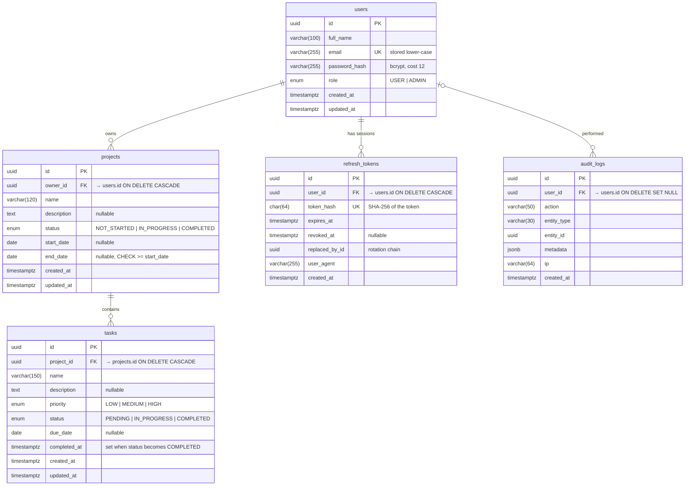

# Database Design

PostgreSQL 17, managed with Prisma migrations ([`apps/api/prisma/schema.prisma`](../apps/api/prisma/schema.prisma),
[`apps/api/prisma/migrations/`](../apps/api/prisma/migrations)).

## ER diagram



An image export of the same diagram is in [`er-diagram.svg`](./er-diagram.svg).

## Tables

| Table | Purpose |
|---|---|
| `users` | Accounts. One account works on web and mobile. |
| `projects` | Projects. Each belongs to exactly one user (`owner_id`). |
| `tasks` | Tasks. Each belongs to exactly one project. |
| `refresh_tokens` | Login sessions (hashed refresh tokens), used for rotation, logout and reuse detection. |
| `audit_logs` | Append-only history of logins, failed logins and every create, update and delete (bonus). |

## Constraints

- **Primary keys:** UUID v4. They are not guessable and are safe to show in URLs.
- **Unique:** `users.email` and `refresh_tokens.token_hash`.
- **Foreign keys:**
  - `projects.owner_id → users` and `tasks.project_id → projects` use `ON DELETE CASCADE`. Deleting a project deletes its tasks.
  - `refresh_tokens.user_id` uses `CASCADE`.
  - `audit_logs.user_id` uses `SET NULL`, so the history survives if a user is deleted.
- **Check:** `projects_end_date_after_start_date` requires `end_date >= start_date`. The API validates this too; the database is the last line of defence.
- **Enums:** status and priority are Postgres enums, so an invalid value can't be stored even by a buggy client.
- **NOT NULL** on every required field. Empty strings never reach the database: the API converts `""` to `NULL` for optional text.

## Indexes

| Index | Serves |
|---|---|
| `projects (owner_id, status)` | Project list filtered by status, and dashboard counts |
| `projects (owner_id, created_at)` | Default "newest first" project list |
| `tasks (project_id, status)` | Tasks of a project filtered by status, and progress counts |
| `tasks (project_id, priority)` | Priority filter |
| `tasks (due_date)` | Overdue count, sorting by due date |
| `refresh_tokens (user_id)` | Revoking all of a user's sessions |
| `audit_logs (user_id, created_at)` | A user's activity feed |

## Normalisation

The schema is in third normal form (3NF):

- Every non-key column depends only on its own table's key.
- **Tasks don't store `owner_id`.** The owner is a fact about the project, so copying it onto tasks would be a transitive dependency and could drift out of sync. Ownership is always derived through the parent project: every task query filters with `project: { ownerId: currentUser }`. The cost is a join. With the `projects (owner_id, …)` indexes, that's cheap at this scale.
- Derived values aren't stored. Task counts, project progress % and dashboard numbers are computed with `COUNT` / `GROUP BY` at query time, so they can never be stale.
- `completed_at` is the one deliberate extra column. It records *when* a task was completed, which the status alone can't tell you.

## Setup

```bash
# 1. Point apps/api/.env at a PostgreSQL database (DATABASE_URL + DIRECT_URL); see apps/api/.env.example.
#    No Postgres installed? Run: npm run db:local -w @pms/api   (embedded server on port 5433)
# 2. Apply migrations
npm run db:deploy -w @pms/api        # production / CI   (prisma migrate deploy)
npm run db:migrate -w @pms/api       # development       (prisma migrate dev)
# 3. Optional demo data (alice@example.com / bob@example.com, password Password123!)
npm run db:seed -w @pms/api
```

The full SQL of the schema is in
[`apps/api/prisma/migrations/20261007024738_init/migration.sql`](../apps/api/prisma/migrations/20261007024738_init/migration.sql).
