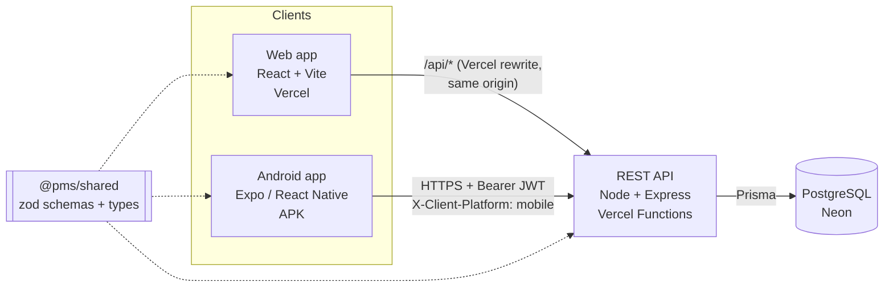

# Design Decisions & Trade-offs

Why the project is built the way it is. Useful for code review and the interview.

## 1. Architecture

- **One backend, one database.** Web and mobile call the same endpoints, so an account or task created on one is immediately visible on the other. The PDF requires this.
- **Monorepo (npm workspaces).** `apps/api`, `apps/web`, `apps/mobile` and `packages/shared`. Reviewers get one repo and one install. The shared package means validation rules exist **once**: the same zod schema validates the web form, the mobile form and the API request (a bonus item).
- **Layered API.** routes (HTTP and middleware wiring) → services (business rules and ownership checks) → Prisma (data). Controllers stay thin and services are testable.

## 2. Technology choices

| Choice | Why | Alternatives considered |
|---|---|---|
| Express 5 | Small and explicit. Async errors reach the error handler natively. | NestJS: more structure, but more ceremony for an API this size |
| PostgreSQL + Prisma | Relational data with real FKs, enums and a CHECK constraint. Prisma gives typed, **parameterised** queries (no SQL injection) and versioned migrations. | MySQL (equally valid); raw SQL (more injection surface) |
| Zod | One schema serves as runtime validator and TypeScript type, shared by all three apps | Joi or class-validator (backend-only) |
| React + Vite | Fast, simple static build, deploys to Vercel/CDN | Next.js: SSR isn't needed for an authenticated dashboard |
| TanStack Query | Caching, loading and error states, refetch on focus, and cache invalidation after mutations, on both web and mobile | Redux: more boilerplate |
| Expo (SDK 57) + expo-router | File-based navigation, OTA-friendly, cloud APK builds with EAS (no Android SDK needed locally) | Bare RN or Flutter |
| Tailwind CSS | Fast and consistent responsive styling | CSS modules |

## 3. Authentication design

- **Passwords** are hashed with **bcrypt, cost 12** (`bcryptjs`, the same algorithm with no native build). The plain password is never stored or logged; pino redacts `password` fields.
- **Access token:** a JWT signed with HS256 that lives **15 minutes**. Its payload is `{ sub, role }`. On verification the API pins the algorithm and checks `iss` and `aud`, so a token from another system, or an `alg: none` token, is rejected.
- **Refresh token:** 384 random bits. Only its **SHA-256 hash** is stored, so a database leak can't be replayed. It lives 7 days and is **rotated on every use**. If an old (already rotated) token is presented, it was stolen or replayed, so **all of that user's sessions are revoked**.
- **Logout** revokes the refresh token server-side. The short-lived access token simply expires. This answers "how do you log out with stateless JWTs?".
- **Where tokens live:**
  - **Web:** the access token is kept **in memory only**, never in localStorage, so XSS can't read it from storage. The refresh token is an **httpOnly, Secure, SameSite=Lax cookie** scoped to `/api/auth`, so JavaScript can't read it. On page load the app calls `/auth/refresh` to restore the session, which meets "stay logged in until logout or token expiration".
  - **Mobile:** cookies are awkward in React Native. The app sends `X-Client-Platform: mobile`, gets the refresh token in the response body, and stores both tokens in **expo-secure-store**, which is backed by the **Android Keystore / iOS Keychain**, as the PDF requires. Nothing sensitive goes in AsyncStorage.
- **Expiry handling** is the same on both clients. An axios interceptor catches a 401 and tries **one** refresh; concurrent 401s share a single refresh call. If the refresh fails, the session is cleared and the user lands on the login screen with **"Your session has expired. Please log in again."**
- **Why the Vercel rewrite?** The web app calls `/api/*` on its own domain and Vercel proxies the call to the API project. That keeps the refresh cookie **first-party**, so it works in Safari and Firefox, which block third-party cookies. CORS is still configured for the web domain (an allowlist from `CORS_ORIGINS`) for any direct browser calls.

## 4. Authorization

- Every query is scoped to the authenticated user. Projects are filtered by `ownerId`. Tasks are filtered by `project.ownerId`, because tasks have no owner column.
- Updates and deletes use **scoped `deleteMany`/`findFirst`** (`WHERE id = ? AND owner_id = ?`), so there's no "check then act" gap.
- Creating a task, or moving one to another project, verifies that **you own the target project**.
- **404 instead of 403** for other users' resources. A 403 would confirm that the ID exists. Returning 404 for both "doesn't exist" and "not yours" leaks nothing. This is covered by `tests/authorization.test.ts`.
- Clients can't set `ownerId`, `role` or other server-controlled columns: zod objects strip unknown fields before they reach the service layer. This is tested too.
- RBAC groundwork: users have a `role` (`USER`/`ADMIN`) in the JWT, and an `authorize(...roles)` middleware exists. No admin-only routes are exposed yet; that's listed under future work.

## 5. Validation & errors

- All input is validated **on the backend**, whichever app sent it:
  - required fields
  - trimmed empty strings
  - email format
  - real calendar dates (rejects `2026-02-30`)
  - enums
  - UUID path params
  - end date ≥ start date
  - pagination bounds
  - a sort-field allowlist
- The same schemas validate forms on web and mobile, so users see the error before a round trip. Server field errors are mapped back onto the form fields.
- There's one error format: `{ success:false, error:{ code, message, details? } }`. Prisma errors are mapped (P2002 → 409, P2025 → 404). Unknown errors return a generic 500 with **no stack trace**; the full error goes to the logs with a request ID.

## 6. Security checklist

| Requirement | Implementation |
|---|---|
| Hashed passwords | bcrypt cost 12 |
| Protected routes | `authenticate` middleware on every non-auth router |
| JWT | HS256, 15 min, iss/aud checked, algorithm pinned, secret ≥ 32 chars enforced at startup |
| Only own data | Ownership-scoped queries, 404 for foreign IDs, dedicated `authorization.test.ts` suite |
| Input validation | Shared zod schemas plus a `validate` middleware for body, query and params |
| No sensitive data in responses | Prisma `select` allowlist (`publicUserSelect`); a test asserts no hash or password in the response |
| SQL injection | Prisma parameterised queries only; no `$queryRawUnsafe`; a test sends `' OR 1=1 --` |
| Rate limiting | Login: 5 failed attempts / 15 min per IP + email. Register and refresh limits. Global API limit. |
| Extra | `helmet` headers, CORS allowlist, 100 KB body limit, `x-powered-by` off, generic login error (no user enumeration), constant-time-ish login (a dummy bcrypt compare for unknown emails), log redaction, env validation at startup |

**Rate-limit key choice:** login is keyed on **IP + email** and counts only failed attempts. A brute-force attack on one account is stopped, while users behind a shared IP (an office, a campus or the Vercel proxy) don't lock each other out.

Known limitation: limiter state is in memory. On serverless each function instance keeps its own counters, so production would use a shared store (Redis / Upstash).

## 7. Product decisions on ambiguous points

| Question | Decision |
|---|---|
| What is "Pending Tasks" on the dashboard? | Tasks whose status is **PENDING**. In-progress and overdue counts are shown separately, so nothing is hidden. |
| Does completing every task complete the project? | No. Project status is the user's decision. The UI shows a separate **progress %** (completed / total tasks). |
| PUT semantics | **Partial update.** Only the sent fields change, so "mark complete" is `PUT /tasks/:id {status:"COMPLETED"}`. |
| Are dates required? | No, they're optional. A past due date is allowed, which is exactly what makes a task "overdue". |
| Projects on mobile | The PDF requires viewing projects and full task CRUD on mobile, so projects are view-only there and created or edited on the web. |
| Mobile offline | Requests fail fast with a clear "You're offline" message. The last fetched data is cached on the device (offline viewing bonus) and an offline banner shows. Saving while offline is blocked with a message. |
| Hosting | Web and API on Vercel (the API as a serverless function wrapping the same Express app), PostgreSQL on Neon. One platform, no idle sleep. `server.ts`, Docker and `render.yaml` keep the long-running option open. Clients still use generous timeouts and a "server may be waking up" message. |

## 8. Testing strategy

- **API integration tests** (Vitest + Supertest) run against a **real PostgreSQL** database, not mocks, so constraints, cascades and enum ordering are exercised:
  - auth
  - authorization
  - validation
  - CRUD
  - search, filter, sort and pagination
  - dashboard counts
  - rate limiting
  - security headers and CORS
  - SQL injection
- **Unit tests** cover the utilities (jwt, bcrypt, tokens, pagination, dates) and the shared schemas.
- **Web tests** (Testing Library) cover the protected-route redirect and login form validation.
- **CI (GitHub Actions)** runs lint, typecheck, all tests against a Postgres service container, the API and web builds, and both Docker image builds on every push.

## 9. What I'd do with more time

- Redis-backed rate limiting and refresh-token storage for horizontal scaling
- Admin UI using the existing `role` claim (RBAC); team or shared projects
- Push notifications for tasks due tomorrow (expo-notifications plus a daily job)
- Offline **writes** on mobile: a mutation queue replayed on reconnect
- E2E tests (Playwright for web, Maestro for mobile)
- Custom domain (`app.` / `api.` on one site) so cookies are same-site without the proxy
